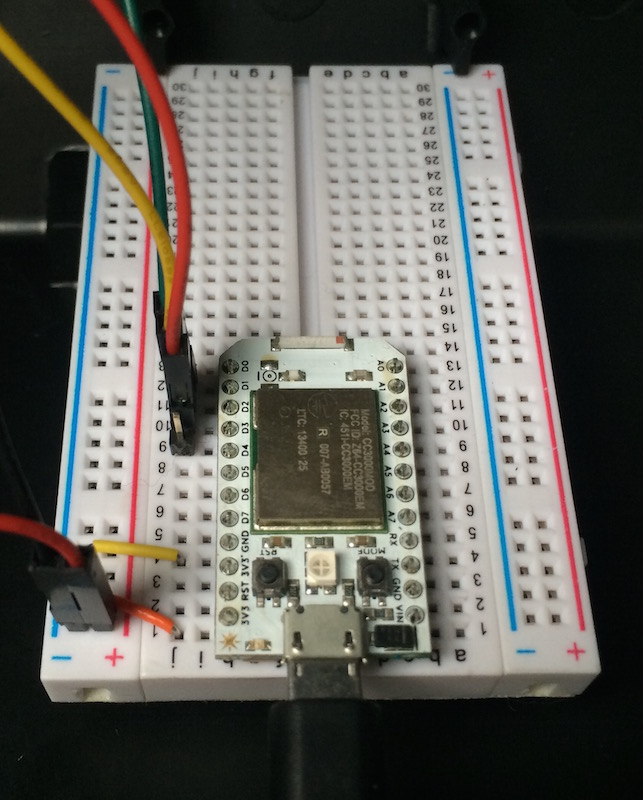
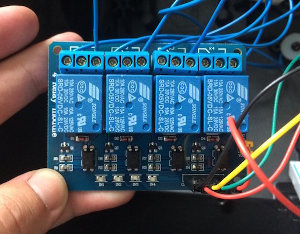

# Travis Lights


I wanted to make it _really_ clear when my builds are broken, so I hooked up a decomissioned & refurbished set of London traffic lights to a [Spark Core](https://www.particle.io/prototype) and built this small ruby web app to redirect travis build push events to it via the Particle API.

These devices are very low powered, so this webapp translates Travis' [webhook notifications](http://docs.travis-ci.com/user/notifications/#Webhook-notification) into the simple POST request required by the [Core API](http://docs.particle.io/core/api/).

If you're interested in building something similar yourself then have a look at the instructions below to see how I put this together!

## Set up your repo

You'll need to configure Travis so that it talks to your traffic light controller app. Add the following lines to your `.travis.yml`:

```yaml
notifications:
  webhooks:
    urls:
      - http://traffic.byjp.me/travis/<your-spark-device-id>
    on_success: always
    on_failure: always
    on_start: always
```

## Deploy the web app

You can find the code for this web application [on github](https://github.com/jphastings/traffic). It's being run on [Digital Ocean](https://www.digitalocean.com/) via [Tutum](https://tutum.co) (a truly splendid combination I should blog about) at http://traffic.byjp.me (though you'll have to deploy your own at the moment).

When you deploy make sure that you have environment variables set up for authentication, requests that don't authenticate correctly will be rejected, so only you can update your traffic lights:

```text
spark.<your-spark-device-id>=<your-spark-token>
travis.<your-repo-owner>=<your-travis-token-for-that-user>
```

## Build your hardware

My hardware was more complex than it needed to be (Particle now offers a [relay shield](https://store.particle.io/?product=relay-shield) which is perfect for this), but still very simple.




I attached my spark to a 4 channel relay module I [found on eBay](http://www.ebay.co.uk/itm/UK-5V-4-Channel-Relay-Module-Shield-for-Arduino-ARM-PIC-AVR-DSP-/231552687750) and rigged each of the three traffic light bulbs to it.

I figured out the hard way that you need to use isolated power supplies for relay control and the spark (the [back emf](https://en.wikipedia.org/wiki/Counter-electromotive_force) from switching the relays on and off occasionally triggers the spark to reset).

Please take care when you wire up the mains lines to the relay, make sure there are no bare wires that might touch other metalic objects and, if you can, cover the mains contacts with electrical tape once you're done. Always completely detach your traffic lights when you're working on the electronics!

## Bring your traffic lights online

Flash your spark with the following C code:

```processing
// Set your pins here
int green = D0;
int amber = D2;
int red = D1;
// The length of time to show a green light for in ms
// Set to -1 for 'show indefinitely'.
int showGreenFor = 60000;

int switchOffAt = 0;

void setup()
{
    pinMode(red, OUTPUT);
    pinMode(amber, OUTPUT);
    pinMode(green, OUTPUT);
    Spark.function("traffic", lightsToggle);
    display(7);
}

void loop()
{
    if (switchOffAt != 0 && millis() >= switchOffAt) {
        display(0);
    }
}

int display(int bits) {
    digitalWrite(green, bits & 1);
    digitalWrite(amber, bits & 2);
    digitalWrite(red, bits & 4);
    
    // Only show green for a little while
    if (showGreenFor > 0) {
        switchOffAt = 0;
        if (bits == 1) {
            switchOffAt = millis() + showGreenFor;
        }
    }
    
    return bits;
}

int lightsToggle(String status) {
    display(status.toInt());
    return 0;
}
```
